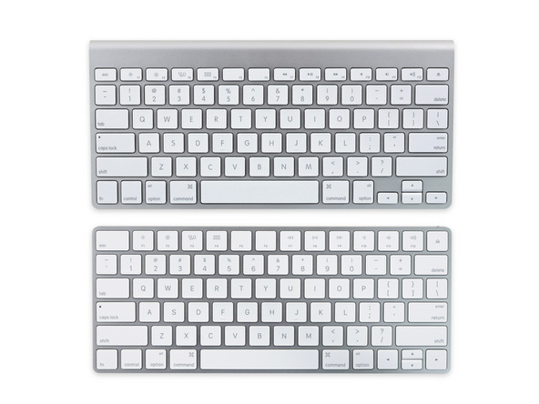
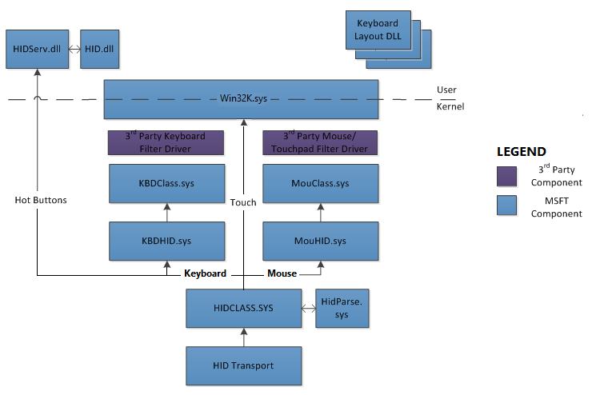

# WinAppleKey
Apple Keyboard (model A1314 and A1644) Driver for Windows 10.



WinAppleKey enables the use of the **Apple Wireless Keyboard (A1314)** and the currently latest **Apple Magic Keyboard (A1644)**
under **Windows 10** (64-bit) without the need of installing any Bootcamp drivers. 

It is a lean piece of software 
that just renders the keyboard fully functional under Windows without any fancy stuff.

Specifically: 
- Swaps the Fn-Ctrl keys to align with standard Windows keyboard layouts (not supported by Apple's Bootcamp driver).
- Maps the missing Windows keys such as the Del, Insert, Print Screen, Pause/Break, etc.
- Respects all the small details such as typematic properties of keys, something which was not possible with the older [WinA1314](https://github.com/samartzidis/WinA1314) driver.
- Includes an installer that automates the task of properly and cleanly installing or uninstalling the driver.

Only 64-bit versions of Windows 10 are currently supported. You may also be able to install the driver on Windows 7, 8 or 8.1 (64-bit) but this has not been tested.

### Technical Details
WinAppleKey is fully implemented as a HIDCLASS LowerFilter WDM kernel mode driver. 



Sitting inbetween HIDCLASS and the bluetooth HID Transport driver allows the interpretation of input data 
before they reach HIDCLASS and get splitted out into TLC interfaces as HID Hot Buttons or as KBDClass (normal keys) input. 
This allows full and proper re-mapping of all of the keys (incl. Fn, Eject), by also respecting typematic properties. 
The older WinA1314 driver was not capable of that as it was implemented using *Francisco Lopes*'s [Interception](http://www.oblita.com/interception.html) driver, 
which is an UpperLevel filter KBDClass class driver. 

As a completely kernel-mode based implementation, it is also more secure that WinA1314 
as it does not expose any keyboard input data to user mode. It also only attaches to the targeted keyboard device
leaving the rest of your keyboard devices unaffected.


### Please Note
Due to the fact that the driver is signed with a self-signed test certificate, Windows does not allow the installation unless it is 
running in **TESTSIGNING** mode. Therefore, to install the driver you have to first reboot your system in TESTSIGNING mode
by issuing the command (in an Administrative prompt): 

``` Bcdedit.exe -set TESTSIGNING ON ```

And for reverting TESTSIGNING mode:

``` Bcdedit.exe -set TESTSIGNING OFF ```

Please make sure that you uninstall WinAppleKey from ```Control Panel``` ```Programs```, before you revert TESTSIGNING mode on your system, as if you forget to do so, your Apple keyboard(s) will temporarily stop working.

Please also make sure that you understand all the potential **[implications](https://msdn.microsoft.com/en-us/windows/hardware/drivers/install/the-testsigning-boot-configuration-option)** of running your system in TESTSIGNING mode before you proceed with the installation as well as the fact that WinAppleKey is ***free software*** that you are willing to build and use completely ***at your own risk.***


### Key Mapppings

**WinAppleKey** creates the following key mappings:

  <table class="table-bordered" cellpadding="5">
    <tr>
      <th>Input Physical Key(s)</th>
      <th>Output Logical Key</th>
    </tr>
    <tr>
      <td>Ctrl</td><td>Fn</td>
    </tr>
    <tr>
      <td>Fn</td><td>Left Ctrl</td>
    </tr>
    <tr>
      <td>Eject</td><td>Delete</td>
    </tr>
  </table>

  And then:

  <table class="table-bordered" cellpadding="5">
    <tr>
      <th>Input Logical Key(s)</th>
      <th>Output Logical Key</th>
    </tr>
    <tr>
      <td>Fn + Left Ctrl</td><td>Right Control</td>
    </tr>
    <tr>
      <td>Fn + Enter</td><td>Insert</td>
    </tr>
    <tr>
      <td>Fn + F5</td><td>Pause/Break</td>
    </tr>
    <tr>
      <td>Fn + F6</td><td>Print Screen</td>
    </tr>
    <tr>
      <td>Fn + Up</td><td>Page Up</td>
    </tr>
    <tr>
      <td>Fn + Down</td><td>Page Down</td>
    </tr>
    <tr>
      <td>Fn + Left</td><td>Home</td>
    </tr>
    <tr>
      <td>Fn + Right</td><td>End</td>
    </tr>
  </table>


  ### Build Instructions

  For building the binaries (driver and installer) you will need Visual Studio 2015 along with an installation of the 
  Windows 10 Driver Kit (WDK). For building the installer project, you will also need to install the WiX toolset (http://wixtoolset.org/) version v3.10.3
  or better. 